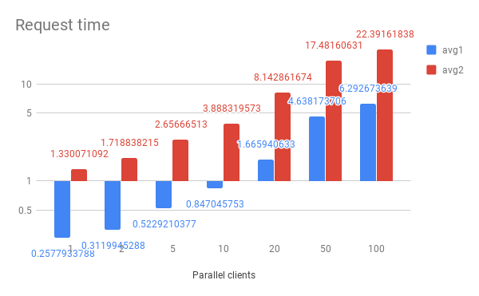

===================
Redis Optimizations
===================

Limitations
===========
- This specification does not consider optimizations at the level of creating resources, e.g. removing Cerberus-based validation of each resource after reading JSON string from Redis and deserializing it;
- This specification does not describe asynchronous replication, using e.g. `Sentinel <https://redis.io/topics/sentinel>`_ master-slave with automatic election of the leader during failover scenario;

Approaches
==========

Overview
--------
Documents are stored as serialized JSON strings at specific keys.  CloudScale applications would GET the entire JSON string, deserialize it, manipulate it, re-serialize and SET it again at the application. This is an anti-pattern.

See `JSON storage <https://redislabs.com/redis-best-practices/data-storage-patterns/json-storage/>`_

Method 1
""""""""
LUA and cjson. Example of approach is here: https://github.com/RedisLabsModules/rejson/blob/master/benchmarks/lua/json-get-path.lua

Pros:

- Better data filtering, since it operates on actual JSON

Cons:

- Same as pure LUA scripting

Method 2
""""""""
Redis 4.0+ have the ability to use modules in the form of binary shared objects (\*.so). Shared objects are loaded into Redis process during initialization and their logic is available immediately after Redis is started.

Let's consider `ReJSON <https://github.com/RedisLabsModules/rejson>`_:

* Intro page: https://oss.redislabs.com/rejson/
* The list of commands that exposes ReJSON: https://oss.redislabs.com/rejson/commands/
* ReJSON does not support complex query logic: `does rejson in redis support complex get query? <https://stackoverflow.com/questions/47518725/does-rejson-in-redis-support-complex-get-query>`_

Current Redis version is:
::

        $ redis-server -v
        Redis server v=3.2.3 sha=00000000:0 malloc=jemalloc-3.6.0 bits=64 build=cd30fb367b05f482

Pros:

- Allows to update JSON string as a single operation, i.e. no need to GET the whole document, update it in Python, and SET it back in Redis
- Supports `JsonPath <http://goessner.net/articles/JsonPath/>`_.

Cons:

- Is too simple. There is no benefit of using it in CloudScale.
- I'd compare this approach to full table scan when it goes about filter+sort+limit+offset. Quite ineffective operation.

Method 3
""""""""
Modify existing keys in Redis to include index field (field to filter by) into key.

Pros:

- Speed of queries will increase

Cons:

- Need to track queries. Only certain queries can be fast. Request for filtering by a new index field should be discussed.
- Require DB migration (modify keys)
- Inflexible approach due to limited number of index fields, possible with this method.

Secondary Index
---------------
Highlights:

 * What is secondary index? https://redis.io/topics/indexes
 * Natively, Redis only offers *primary key access*.
 * `MySQL vs. Redis <https://db-engines.com/en/system/MySQL%3BRedis>`_ has a note on `RediSearch module <https://oss.redislabs.com/redisearch/>`_ for Secondary Index.

RediSearch module
"""""""""""""""""
Highlights:

 * `Python client <https://github.com/RedisLabs/redisearch-py>`_
 * Youtube video from creator of ReJSON `RedisConf17 Deploying the RediSearch Module at Scale & an Intro to the ReJSON module - Itamar Haber <https://www.youtube.com/watch?v=MDnHFWTxDPQ>`_
 * `RedisConf17 Slides <https://www.slideshare.net/RedisLabs/redisconf17-searching-billions-of-documents-with-redis>`_
 * This module (and modules overall) require a Redis 4 build.
 * N.B.: On timeout, the default behavior is that redisearch return its best effort. (Default timeout is 500ms, see https://oss.redislabs.com/redisearch/Configuring/)

Alpine
''''''
Failed to compile RediSearch module on Alpine 3.8: CC compiler errors.
Redis 4 is available from Alpine 3.7.

CentOS
''''''
Able to compile RediSearch module on CentOS 7.
Redis 4 is not available on CentOS 7. Maximum available version from EPEL http://epel.mirror.omnilance.com/7/x86_64/Packages/r/: 3.2.12.
Redis 4 should be compiled from the source code.

Ubuntu
''''''
Ubuntu 16.04, 18.04: 33% tests passed, 57 tests failed out of 85

Debian
''''''
Debian 8, 9: 33% tests passed

RedisLabs's Debian 9 image redislabsmodules/rmbuilder:
::

        FROM redislabsmodules/rmbuilder:latest as builder
        <build steps>

100% tests passed.

This require 2 dockerfiles for building:

1) redislabsmodules/rmbuilder for building redisearch.so. This produces ~625MB image;
2) Debian 9 or Ubuntu 18.04 (redis server v. 4.0.9) for production environment;

Transactions
------------
For transactions support and pipelining: https://github.com/RedisLabs/redis-py
CloudScale should do read-update-write in transactions.

String or HashMap?
------------------
TBD

Performance side-by-side
------------------------
Experiments:
 - LUA initial version
 - LUA + cjson
 - Redisearch

Minikube parameters: memory - 2G, cpus - 2

Experiment parameters:
 - `Performance test script <https://github.com/taras-lviv-vs/k8s_redis4_modules/blob/master/test/lua.py>`_
 - request time - min/max/avg
 - number of requests, total
 - number of parallel clients
 - CPU, RAM monitoring with 'top' utility on Redis master
 - 100K documents in redis
 - 3 redisearch indexes created
 - Redis configuration: master + 2 slaves + sentinel

Commands:
 ::

         time seq 20 | parallel -j8 'echo {}; time python perf/lua.py --kind=redisearch' >& /tmp/out.log &
         cat /tmp/out.log|grep taken|cut -d' ' -f3|cut -d's' -f1| python -c "import sys; l=[float(r) for r in sys.stdin.readlines()]; print(len(l), min(l), max(l), sum(l)/len(l))"

+-------------+-----------------+-------------------------+-------------------------------+----------------------+-----------------+-----------------+
| Experiment  | Num of requests | Num of parallel clients | Min/max/avg request time, sec | Total exec time, sec | CPU (master), % | RAM (master), % |
+=============+=================+=========================+===============================+======================+=================+=================+
| LUA         | 10              | 3                       | 39.8 / 138.7 / 80.3           | 270                  | 10              | 8               |
+-------------+-----------------+-------------------------+-------------------------------+----------------------+-----------------+-----------------+
| LUA & cjson | 10              | 3                       | 38.5 / 129.9 / 68             | 249                  | 10              | 10              |
+-------------+-----------------+-------------------------+-------------------------------+----------------------+-----------------+-----------------+
| Redisearch  | 10              | 3                       | 0.063 / 0.824 / 0.330         | 2.5                  | 2.7             | 11              |
+-------------+-----------------+-------------------------+-------------------------------+----------------------+-----------------+-----------------+

Side-by-side comparison of more parallel clients (10, 100, ...) does not look practical due to significant advantage of redisearch solution.
Also, since Redis is single-threaded and does not support parallel queries, it appears that many queries in "LUA" and "LUA + cjson" experiments fail with "BUSY" error: "BUSY Redis is busy running a script". Failure rate column in the table below shows percentage of queries that failed with that error.

+-------------+-----------------+-------------------------+-----------------+-------------------------------+----------------------+
| Experiment  | Num of requests | Num of parallel clients | Failure rate, % | Min/max/avg request time, sec | Total exec time, sec |
+=============+=================+=========================+=================+===============================+======================+
| LUA         | 20              | 8                       | 20              | 41.06 / 218 / 141.74          | 345                  |
+-------------+-----------------+-------------------------+-----------------+-------------------------------+----------------------+
| LUA & cjson | 20              | 8                       | 25              | 38.32 / 342.6 / 158.81        | 390                  |
+-------------+-----------------+-------------------------+-----------------+-------------------------------+----------------------+
| Redisearch  | 20              | 8                       | 0               | 0.141 / 2.211 / 0.779         | 3.4                  |
+-------------+-----------------+-------------------------+-----------------+-------------------------------+----------------------+

From the table above, the default timeout set in the Redisearch module (500ms) is not enough for such dataset. I've reconfigured module by increasing timeout value to 10s, so that the timeout does not occur.

Redisearch
""""""""""

Create Index
''''''''''''

Easy formula:
::

        Adding one index adds number of index records equal to the number of data records, so when adding all records takes X time, creating one index takes X time.
        Creating 2 indexes takes 2*X time, 3 indexes takes 3*X time:

        (ve3.6mac) ➜  cloudscale git:(develop) ✗ time python perf/lua.py --init-db
        'init db:'
        python perf/lua.py --init-db  9.25s user 2.50s system 7% cpu 2:36.61 total
        (ve3.6mac) ➜  cloudscale git:(develop) ✗ time python perf/lua.py --build-id
        'build id:'
        python perf/lua.py --build-id  18.66s user 5.19s system 5% cpu 7:35.10 total

Command
''''''

Run 100 requests in 10 parallel https://www.gnu.org/software/parallel/man.html jobs:
::

        time seq 100 | parallel -j10 'echo {}; time python perf/lua.py --kind=redisearch'

Request Time
''''''''''''
Request time depending on number of parallel clients:
::

        clients,min,max,avg
        1,0.14613699913024902,0.3551449775695801,0.25779337882995607
        2,0.15966796875,0.6355469226837158,0.31199452877044676
        5,0.13125395774841309,1.3304510116577148,0.5229210376739502
        10,0.11668705940246582,2.117016077041626,0.8470457530021668
        20,0.04387712478637695,5.573847055435181,1.6659406328201294
        50,0.25347089767456055,12.975162029266357,4.6381737055778505
        100,0.03702402114868164,22.13362979888916,6.292673638820649

The same performance test but including heavy index write test, to make sure index rebuilding does not break things down.
The number of parallel writing clients is 10:

::

        time seq 10 | parallel -j10 'echo {}; time python perf/lua.py --kind=update_docs' >& /tmp/out2.log &; time seq 100 | parallel -j10 'echo {}; time python perf/lua.py --kind=redisearch' >& /tmp/out.log &

Request time under heavy 'write' load:

::

        clients,min,max,avg
        1,0.3305060863494873,9.426476240158081,1.3300710916519165
        2,0.5304579734802246,10.556098937988281,1.7188382148742676
        5,0.5482828617095947,12.211752891540527,2.65666512966156
        10,0.7311320304870605,13.516964197158813,3.8883195734024047
        20,3.5726687908172607,21.529234170913696,8.14286167383194
        50,11.699146032333374,30.637272834777832,17.481606307983398
        100,12.728874921798706,40.846710205078125,22.391618380069733

Request time read vs read-write tests:

::

	clients,avg1,avg2
	1,0.25779337882995607,1.3300710916519165
	2,0.31199452877044676,1.7188382148742676
	5,0.5229210376739502,2.65666512966156
	10,0.8470457530021668,3.8883195734024047
	20,1.6659406328201294,8.14286167383194
	50,4.6381737055778505,17.481606307983398
	100,6.292673638820649,22.391618380069733

The above data plotted in a chart:

